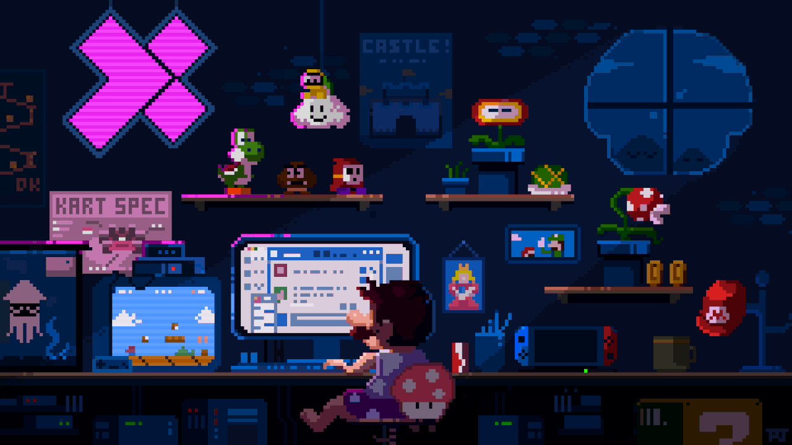

<div align="center">
    
             
    
    
    
<br>
    

<br>
</div>
<br>
<div align="center">
<!-- Header Banner -->

</div>

<p align="center">
  <strong>🚀 Code risk-taker · AI Driven · Prompt Engineer</strong><br>
  <em>Do smart-work. Believe in the long-term process.</em><br>
  Aiming to be Full-Stack with consistency.
</p>

<!-- Coding Header Image -->
<!--  -->


---

## `// 🧑‍💻 About Me`

```javascript
const HASAN = {
  name: "S.M. Hasan Ul Islam",
  alias: "CoderGUY47",
  location: "Mirpur, Dhaka, Bangladesh 🇧🇩",
  role: "Aspiring React Frontend Web Developer",
```
## `// 📚 Currently Learning`


## `// 💡 Expertise`


```javascript
  contact: {
    email: "s.m.hasan4599@gmail.com",
    github: "@CoderGUY47"
  },
  
  philosophy: {
    mantra: "Do smart-work. Trust the long-term process.",
    cssWisdom: "overflow: hidden; /* life philosophy */"
  }
};
```

---

## `// 🚀 Featured Projects`
<div align="center">
<table>
  <tr>
    <td width="33.33%" valign="top">
      <h3 align="center">🎯 C2C Book Hub</h3>
      <div align="center">
        
        <br>
        <a href="https://oxpecker.pro.bd/" target="_blank">
          
        </a>
      </div>
    </td>
    <td width="33.33%" valign="top">
      <h3 align="center">🌟Floka Agency</h3>
      <div align="center">
            
            <br>
        <a href="https://floka-digital-agency.netlify.app/" target="_blank">
          
        </a>
      </div>
    </td>
    <td width="33.33%" valign="top">
      <h3 align="center">👾Github Issue Tracker</h3>
      <div align="center">
        
        <br>
        <a href="https://ph-5-github-issue-tracker.netlify.app/" target="_blank">
          
        </a>
      </div>
    </td>
  </tr>
</table>

</div>

---

## `// 💡 My Tech Forge`

*Skills I've built, tools I've wielded, lessons that stuck.*

<table>
  <tr>
    <td width="50%" valign="top">
      <h3>⚛️ React.js & Next.js</h3>
      <p>Building fast, modern web apps with component-driven architecture and server-side rendering. My go-to stack for anything that needs to feel <em>alive</em>.</p>
      <p>
        
        
        
      </p>
    </td>
    <td width="50%" valign="top">
      <h3>✦ Tailwind & Shadcn UI</h3>
      <p>Crafting clean, professional UIs that make users say <strong>"Wow"</strong> — utility-first, never cookie-cutter. Good design is a system, not a style sheet.</p>
      <p>
        
        
      </p>
    </td>
  </tr>
  <tr>
    <td width="50%" valign="top">
      <h3>◈ AI-Driven Development</h3>
      <p>Leveraging AI to write smarter, cleaner code — augmenting skills, not replacing thought. The best engineers know which tools to trust.</p>
      <p>
        
        
      </p>
    </td>
    <td width="50%" valign="top">
      <h3>⬡ Scalable Architecture</h3>
      <p>Structuring projects so they stay maintainable as they grow — not just functional today, but future-proof tomorrow.</p>
      <p>
        
        
      </p>
    </td>
  </tr>
</table>

---

## `// ⚒️ Tech Stack`

<div align="center">

### Frontend


### Backend & Database *(learning)*


### Tools & Design


</div>

---

## `// 📊 Activity Graph`

<div align="center">


</div>

---

## `// 🔥Streak`

<div align="center">


</div>

---

## `// 🐍Contribution`

<div align="center">


</div>

---

## `// 🏆 GitHub Trophies`

<div align="center">


</div>

---

## `// 🔗 Connect With Me`

<div align="center">

[](https://linkedin.com/in/dev-s-m-hasan-47guy)
[](https://www.facebook.com/s.m.hasan.369)
[](https://github.com/CoderGUY47)
[](mailto:s.m.hasan4599@gmail.com)

</div>

---

## `// ☕ Support My Work`

<div align="center">

<a href="https://www.buymeacoffee.com/coderguy47" target="_blank">
  
</a>

<p><em>If my work helped you, consider buying me a coffee! ☕</em></p>

</div>

---

<div align="center">


**Made with 💜 by HASAN · [@CoderGUY47](https://github.com/CoderGUY47)**

*"overflow: hidden; /\* life philosophy \*/"*

</div>
